# Simple Hermes Codex 实现细节图

这份图集用于快速理解当前实现，而不是画产品宣传图。图里的模块名尽量对应真实文件、函数和状态字段，方便从图跳回代码。

## 1. 总体分层

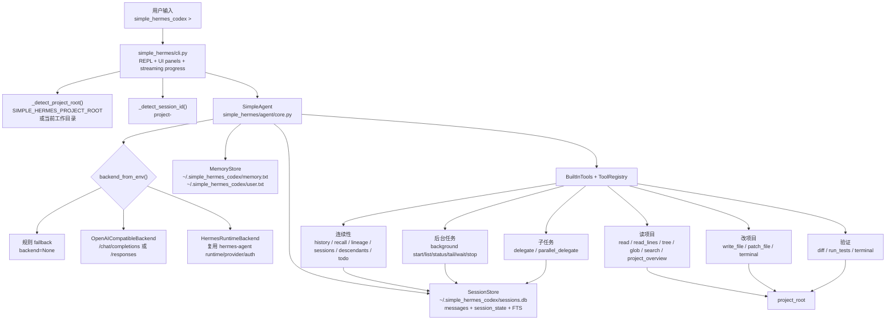

## 2. CLI 实时 step 输出链路

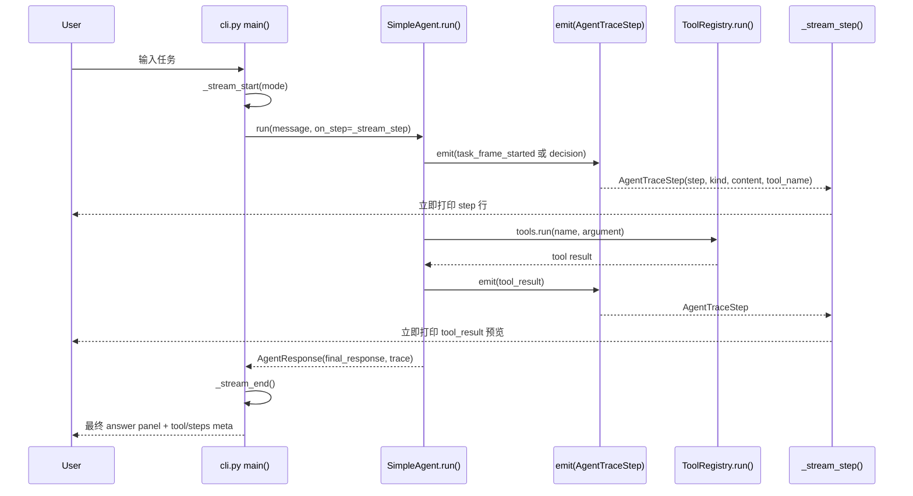

关键实现点：

- `SimpleAgent.run(message, on_step=...)` 内部用 `emit()` 同时写入 `trace` 和触发回调。
- CLI 只负责渲染，不知道 agent 的内部状态机。
- `_preview_step_content()` 截断长 tool result，避免把终端刷乱。

## 3. Agent 主循环

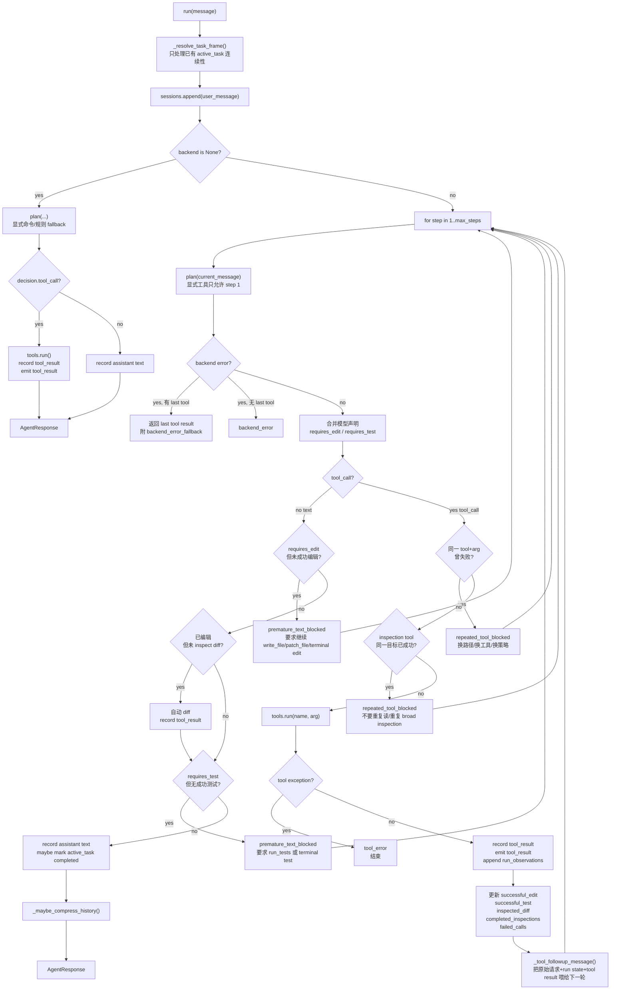

## 4. 通用工作流 ledger

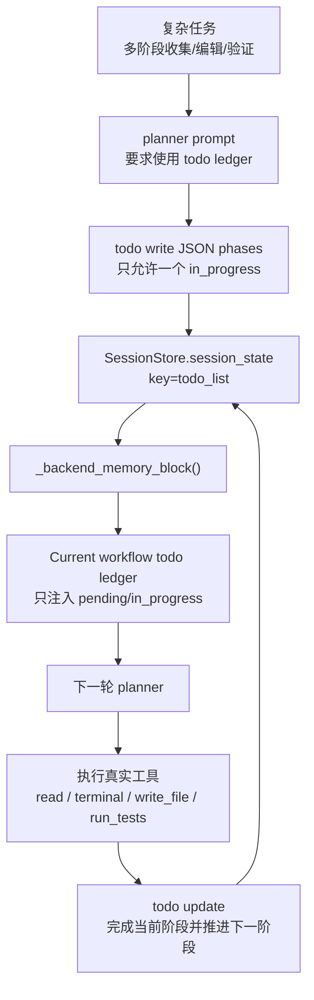

这个机制来自对 Hermes/Codex trace 的对比：稳定的 code agent 不只靠 prompt 热情，而是需要一个显式、可持久、会被下一轮 planner 看见的进度结构。

- `todo` 是通用 session 工具，不包含任何 DailyTrack 专用关键词或偏好。
- `todo_list` 存在 `SessionStore` 的 state 表里，随当前 session 持久化。
- planner 负责决定何时创建阶段、何时推进阶段；Python 主循环只负责保存、校验并注入上下文。
- 已完成阶段不会反复注入，减少模型在长任务里重新做 broad inspection。
- `todo update`、`todo add` 这类复合工具名会被 `_normalize_tool_call()` 归一化，避免模型把动作写进 tool name 后工具层无法执行。

## 5. 代码任务 guard 和恢复路径

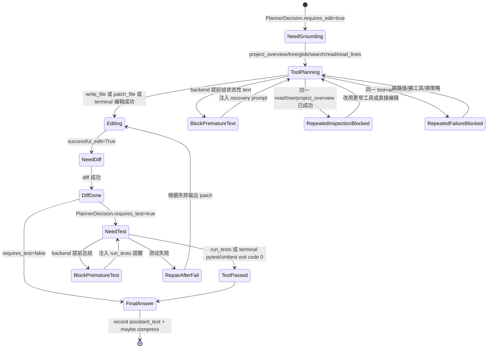

## 6. Planner backend 模式

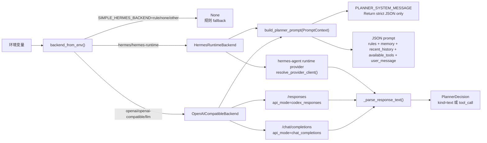

## 7. ToolRegistry 和权限路径

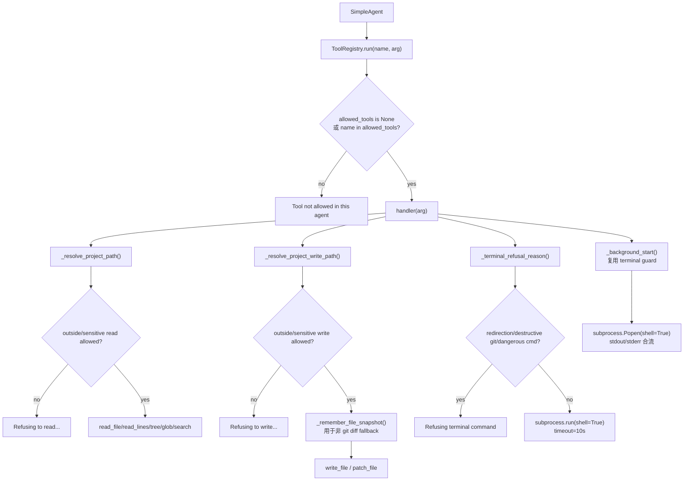

## 8. 状态持久化关系

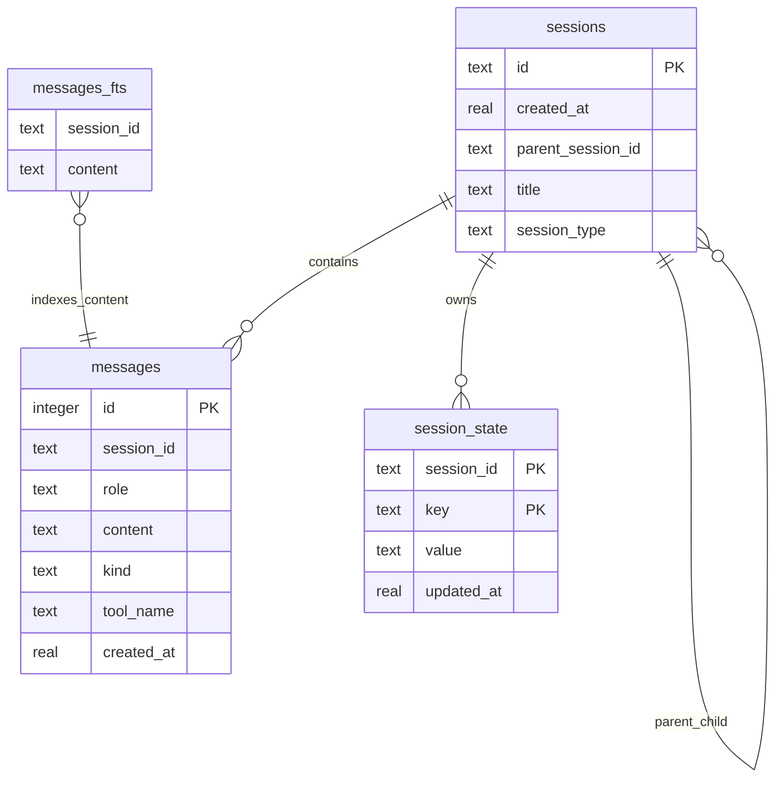

## 9. Active task 多轮连续性

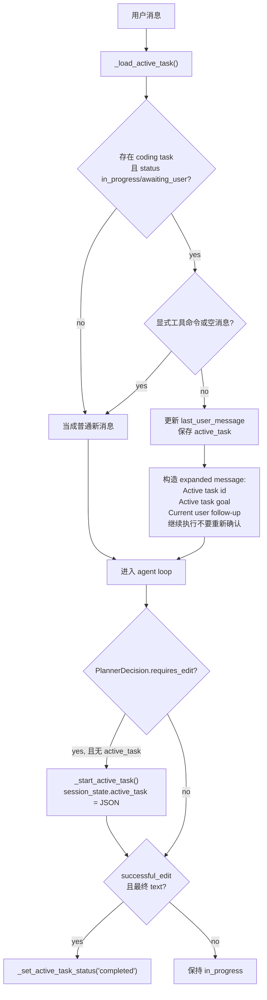

## 10. 上下文压缩和 continuation session

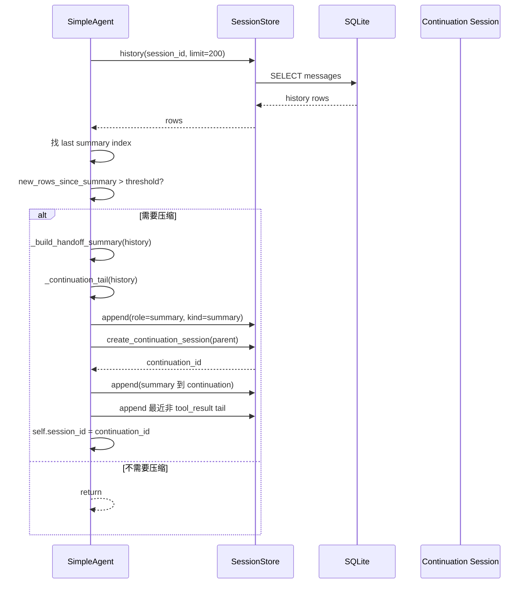

## 11. Background task 生命周期

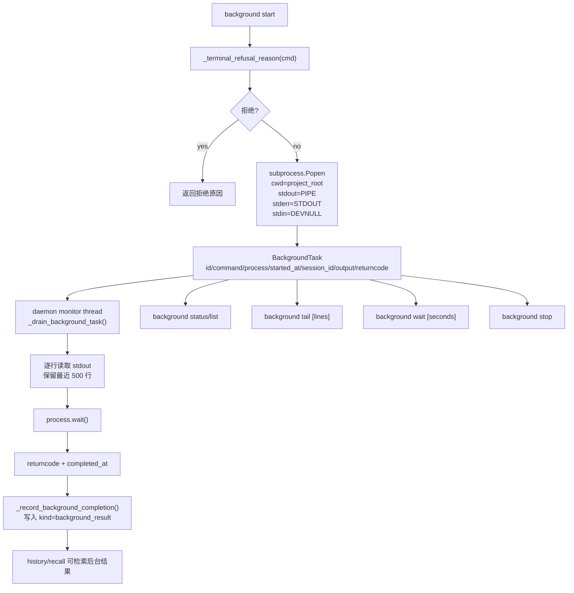

## 12. Delegation 和 parallel delegation

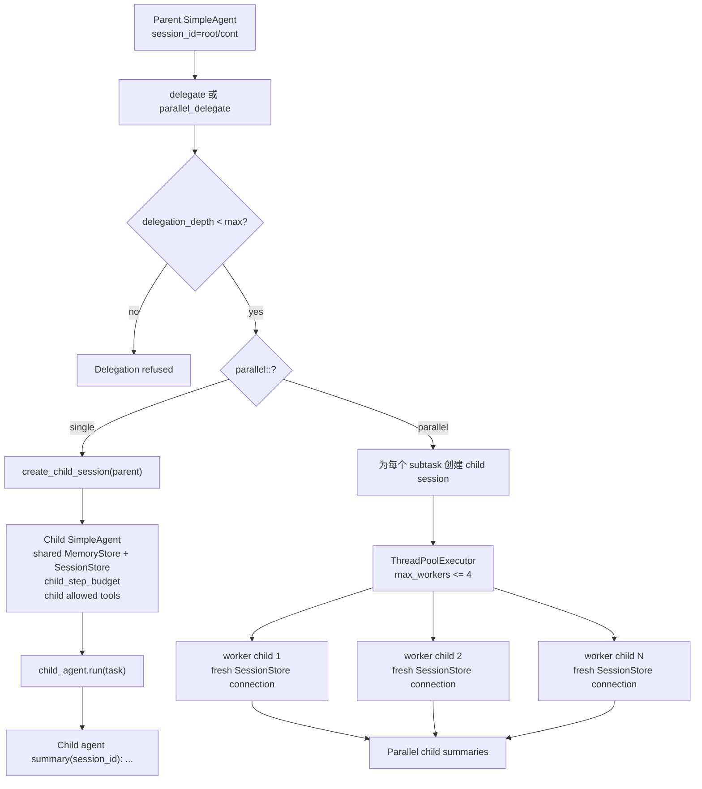

## 13. Benchmark harness

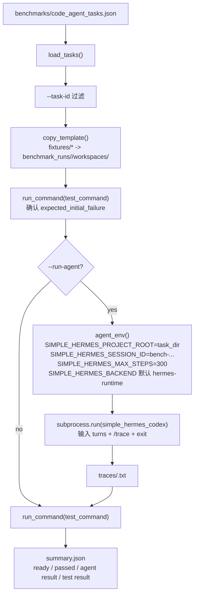

## 14. 一次复杂代码修改任务的完整闭环

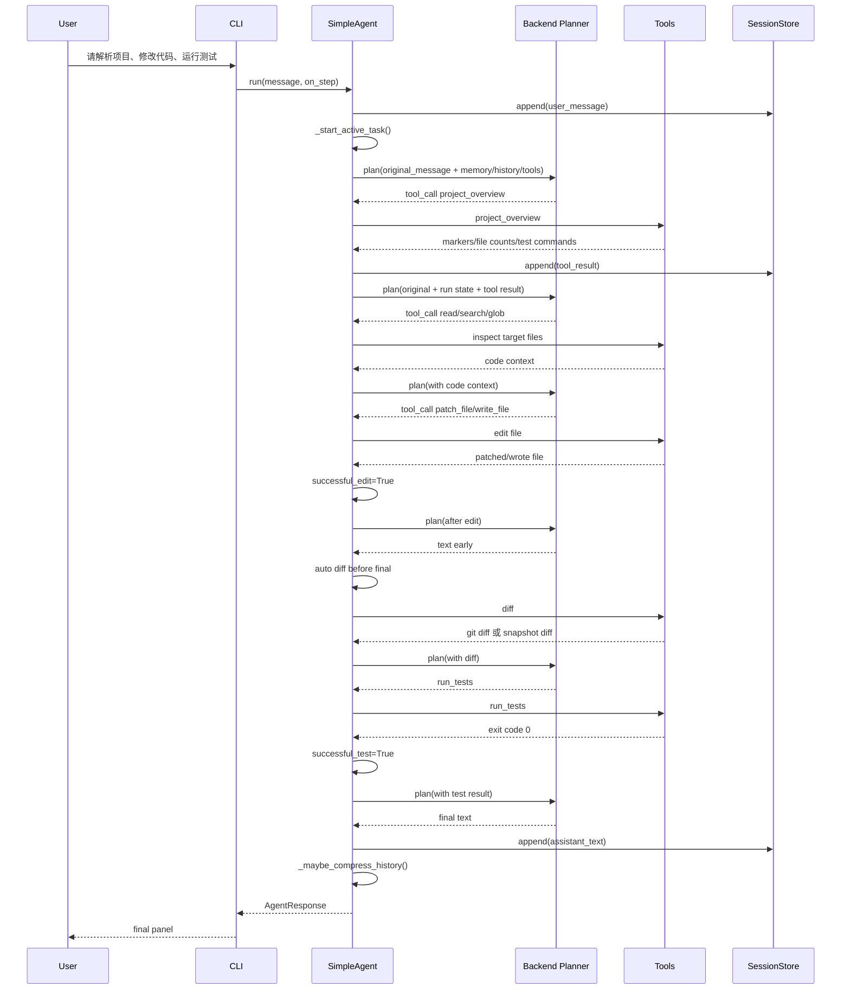

## 15. 文件到职责映射

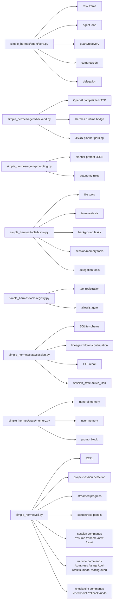

## 16. Slash session commands

```mermaid
flowchart TD
    Input["用户输入 slash command"] --> Handler["_handle_ui_command()"]
    Handler --> Kind{"命令类型"}

    Kind -->|/resume 无参数| List["_format_recent_sessions()\n展示最近 session 和序号"]
    Kind -->|/resume number| Pick["recent_sessions()[index-1]"]
    Kind -->|/resume latest| Latest["recent_sessions()[0]\n最近会话"]
    Kind -->|/resume project| Project["latest_continuation_or_self(default project session)"]
    Kind -->|/resume session-id| Exact["session_info(session-id)"]
    Pick --> Switch["agent.session_id = target\nagent.last_trace = []"]
    Latest --> Switch
    Project --> Switch
    Exact --> Switch
    Switch --> ResumePanel["Resume panel\nsession id/title/type/message count"]

    Kind -->|/rename title| Rename["SessionStore.rename_session(current, title)"]
    Rename --> RenamePanel["Rename panel\n当前 session + title"]

    Kind -->|/new title| New["ensure_session(project/chat-id)\n切换 agent.session_id"]
    Kind -->|/reset| Reset["clear_session_messages()\n清空 messages + session_state"]
    Kind -->|/compress| Compress["SimpleAgent.compress_now()\nsummary + continuation"]
    Kind -->|/usage| Usage["SessionStore.usage_summary()"]
    Kind -->|/tool-results| ToolResults["SessionStore.recent_tool_results()\n查看存储的 tool output 引用"]
    Kind -->|/model| Model["显示或设置 backend.model"]
    Kind -->|/background prompt| Background["start_background_agent()\nchild session + daemon thread"]
    Kind -->|/retry| Retry["last_user_message()\n重新进入 run()"]
    Kind -->|/checkpoint| Checkpoint["CheckpointStore.create/list"]
    Kind -->|/rollback 或 /undo| Rollback["CheckpointStore.restore()"]
```

## 17. Checkpoint / rollback

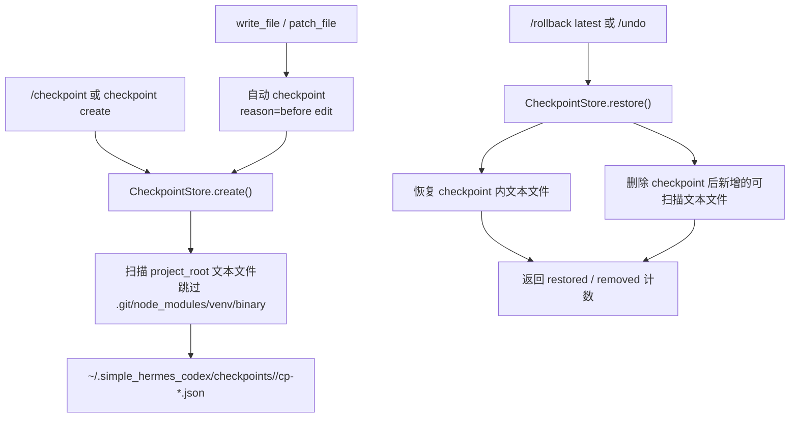

## 18. HTML test report

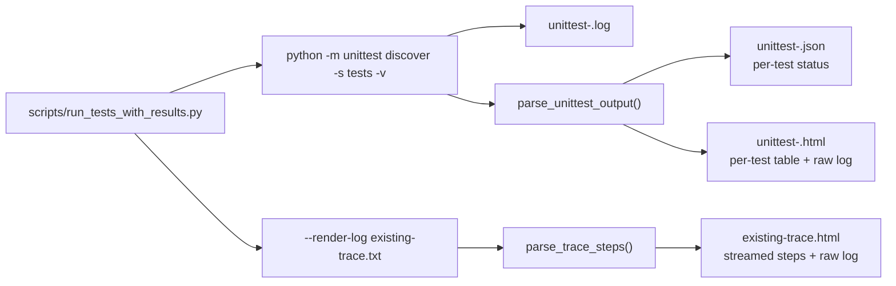
